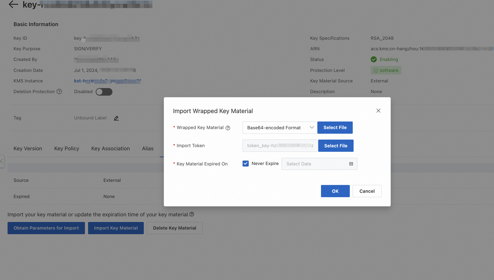

# Alibaba Cloud Secret Manager plugin for Notation

English | [简体中文](./README-zh_CN.md)

This repository contains the implementation of the [Alibaba Cloud Secret Manager](https://www.alibabacloud.com/help/en/kms/support/overview-6) signing plugin for [Notation](https://notaryproject.dev/). User could use the keys and ceritificates in Alibaba Cloud Secret Manager to sign the specified artifact based on the [plugin specification](https://github.com/notaryproject/specifications/blob/main/specs/plugin-extensibility.md) of Notation community.

> **Note** The Notary Project documentation is available [here](https://notaryproject.dev/docs/). You can also find the Notary Project [README](https://github.com/notaryproject/.github/blob/main/README.md) to learn about the overall Notary Project.


## Quick start

This document demonstrates how to sign and verify an OCI artifact with Alibaba Cloud Secret Manager plugin for Notation.


#### Plugin Spec Compatibility

| Capability       | Compatibility                                                |
| ---------------- | ------------------------------------------------------------ |
| keySpec          | `RSA-2048`, `RSA-3072`, `EC-256`                             |
| hashAlgorithm    | `SHA-256`                                                    |
| signingAlgorithm | `RSASSA-PSS-SHA-256`                                         |
| pluginCapability | `SIGNATURE_GENERATOR.RAW`, `SIGNATURE_VERIFIER.TRUSTED_IDENTITY`, `SIGNATURE_VERIFIER.REVOCATION_CHECK` |
| signingScheme    | `notary.x509`                                                |


## Getting Started:

The following summarizes the steps to configure the notation-alibabacloud-secret-manager plugin and sign and verify a container image.

- Install notation [CLI](https://github.com/notaryproject/notation/releases/tag/v1.1.1). Version v1.1.1 has been tested. Note that `make install` creates the plugin directory structure based on a MacOS environment. Update the Makefile based on your OS. It then copies the plugin to the appropriate location based on the notation plugin directory structure spec.

- This plugin leverages the [KMS Instance SDK](https://www.alibabacloud.com/help/en/kms/developer-reference/kms-instance-sdk-for-go/), which means you'll need to meet the pre-requisites and customize the environment as follows：

| Env                                  | Description                                                  |
| ------------------------------------ | ------------------------------------------------------------ |
| ALIBABA_CLOUD_ACCESS_KEY_ID          | Alibaba Cloud Account Access Key ID                          |
| ALIBABA_CLOUD_ACCESS_KEY_SECRET      | Alibaba Cloud Account Secret Access Key                      |
| ALIBABA_CLOUD_KMS_INSTANCE_ENDPOINT  | VPC Endpoint of the Dedicated KMS Instance, for example, kst-hzxxxxxxxxxx.cryptoservice.kms.aliyuncs.com |
| ALIBABA_CLOUD_KMS_CLIENTKEY_FILEPATH | Local File Path of the ClientKey Credential for the Dedicated KMS Instance Application Access Point (AAP) |
| ALIBABA_CLOUD_KMS_PASSWORD           | Password for the Dedicated KMS Instance Application Access Point (AAP) |
| ALIBABA_CLOUD_KMS_CA_FILEPATH        | Local Path of the CA Certificate for the Dedicated KMS Instance |

*Note: the notation-alibabacloud-secret-manager plugin supports various Credential configuration methods. For more details, please refer to [credentials](https://aliyuncontainerservice.github.io/ack-ram-tool/#credentials)*

## Installation

You can download the latest version of plugin binary from the [Releases](https://github.com/AliyunContainerService/notation-alibabacloud-secret-manager/releases) , or choose to build and install from source:

```bash
git clone
cd notation-alibabacloud-secret-manager
make build
```


after downloading or building the corresponding plugin binary, the installation can be completed on the target environment by executing the following notation CLI commands:

```bash
notation plugin add --file ./notation-alibabacloud.secretmanager.plugin
```

*Note: the `-file`  should be identical to the path of the plugin binary*


## Manager KMS instance：

Users could enable and manage KMS instances from the console, please refer to  [enable KMS instances](https://www.alibabacloud.com/help/en/kms/key-management-service/user-guide/manage-kms-instances#section-yal-idg-c4y).

The plugin supports two types of key signing: using a KMS instance created and managed key or using a self-signed and imported keypair meterial:

### Method 1: Create and manage keys in KMS instance

Users can [create a key](https://help.aliyun.com/en/kms/key-management-service/user-guide/manage-keys-2) in the KMS service console by following these steps.

1. Log on to the Key Management Service console. In the top navigation bar, select a region. In the left-side navigation pane, choose ***\*Resource\** > \**Keys\****.

2. On the **Keys** page, click the **Default Key** tab.

3. In the Create Keys panel, complete the configuration settings, noting that you need to select **Asymmetric Keys** for Key Type, **SIGN/VERIFY** for Key Usage,  and select the key specifications supported by Plugin Spec Compatibility above (`RSA-2048`, `RSA-3072`, `EC-256`), and then click OK.


## Generate and import the keypair meterial

A user can bring their own private key and certificate. As a quick start, this tutorial is using openssl to generate a private key and a certificate

1. Create an asymmetric key in KMS console, please refer to [step1](https://www.alibabacloud.com/help/en/kms/user-guide/import-key-material-into-an-asymmetric-key#p-qcf-3d4-pel)
2. Download a wrapping public key and an import token, please refer to [step2](https://www.alibabacloud.com/help/en/kms/user-guide/import-key-material-into-an-asymmetric-key#p-f9p-n7u-88m)
3. Use the wrapping public key to encrypt key material, please refer to [step3](https://www.alibabacloud.com/help/en/kms/user-guide/import-key-material-into-an-asymmetric-key#p-jar-kxa-iun)
4. Import key material, please refer to [step4](https://www.alibabacloud.com/help/en/kms/user-guide/import-key-material-into-an-asymmetric-key#p-j5c-vp9-9vd)
   

*User can use the following command to obtain the x509 certificate for signature verification based on the private key TakPrivPkcs1.pem from step 3 above and the server_cert configuration in [openssl.cnf](. /docs/sample_openssl.cnf) , or use the plugin to automatically export the certificate when signing.*

```bash
openssl req -x509 -new -nodes -key TakPrivPkcs1.pem  -sha256 -days 3650 -out sign.crt -config openssl.cnf -extensions server_cert
```


## Sign an artifact using Notation

Now we've done all the configurations. Let's sign an artifact using Notation. (If you haven't done so, download notation from [here](https://github.com/notaryproject/notation/releases).)
```bash
notation sign --id <keyId> --plugin alibabacloud.secretmanager.plugin  <myRegistry>/<myRepo>@<digest> --plugin-config output_cert_dir=<dirPath>
```


| Parameter     | Description                                                  |
| ------------- | ------------------------------------------------------------ |
| id            | Specificed Alibaba Cloud KMS Instance ID                     |
| plugin-config | Plugin customized parameters, support the following configurations: <br />     output_cert_dir：User can use this parameter to issue hte corresponding x509 certificate based on the specified KMS key during the signing process, and output it as a file to the directory specified in this parameter. <br />     ca_certs：When signing with the imported self-signed key meterial, if you also self issued an x509 certificate with the key,  you can use the parameter to specify the filepath of the self-signed certificate. |


## Verify the artifact using Notation
1. Configure trust store.
    ```bash
    ./notation cert add -t ca -s ack.notation "{path-to-cert}/signer.crt"
    ```
   where `sign.crt` is the cert generated in the previous step.
2. Configure the trust policy.
    ```bash 
    cat <<EOF > ./trustpolicy.json
    {
        "version": "1.0",
        "trustPolicies": [
            {
                "name": "acr-hangzhou-images",
                "registryScopes": [ "<myRegistry>/<myRepo>" ],
                "signatureVerification": {
                    "level" : "strict"
                },
                "trustStores": [ "ca:ack.notation" ],
                "trustedIdentities": [
                    "*"
                ]
            }
        ]
    }
    EOF
    ```
    ```bash
    ./notation policy import ./trustpolicy.json
    ```
3. Verify the artifact
    ```bash
    ./notation verify <myRegistry>/<myRepo>@<digest> -v